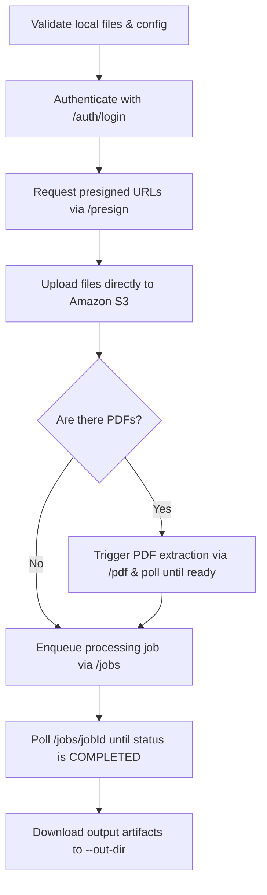

# CLI Job Submission Tool (`submit_job.py`)

The `submit_job.py` utility script is a powerful, self-contained Python tool located at `[submit_job.py](file:///c:/Users/Daniel/archivault/archival_materials_ingest/utility_scripts/submit_job.py)`. It allows archivists, developers, and researchers to bypass the web interface and submit ingestion/processing jobs directly to the Archivault API.

This CLI tool manages the complete lifecycle of a job—from local file validation and user authentication, to secure S3 uploads, PDF processing, asynchronous execution polling, and downloading of the finished outputs.

---

## 🚀 Quick Start

### Prerequisites
* **Python**: 3.6 or higher.
* **Dependencies**: Install the required `requests` package:
  ```bash
  pip install requests
  ```

### Simple Execution Example
Run the script by providing the directory of source images, your login credentials, and the desired processing steps:

```bash
python utility_scripts/submit_job.py \
  --dir "./my_scans" \
  --email "archivist@example.com" \
  --password "SecurePassword123" \
  --title "19th Century Land Records" \
  --steps transcribe ner \
  --out-dir "./my_downloads"
```

---

## 🔄 Job Lifecycle & Execution Flow

When you execute `submit_job.py`, it orchestrates the following backend operations:



1. **Local Audit**: Validates that the input directory has supported files (`.pdf`, `.jpg`, `.jpeg`, `.png`, `.tif`, `.tiff`). It also validates context and foliation files if supplied.
2. **Session Authentication**: Sends `--email` and `--password` to `POST /auth/login` to retrieve a JWT bearer token.
3. **Presign Request**: Calls `POST /presign` with your job parameters and file list to fetch unique Amazon S3 upload URLs and a job ID.
4. **S3 File Stream**: Streams source images and optional helper files directly to Amazon S3 using HTTP `PUT` requests with automatic MIME-type guessing.
5. **PDF Conversion**: If PDF files are detected, it triggers `POST /pdf` to extract pages to images on the server, polling the API until the server-side extraction is complete.
6. **Execution Trigger**: Initiates asynchronous background processing by calling `POST /jobs`.
7. **Status Polling**: Every 5 seconds, queries `GET /jobs/{jobId}` to monitor the progress (`transcribing`, `foliating`, etc.) until it transitions to `COMPLETED` or `FAILED`.
8. **Artifact Retrieval**: Stream-downloads the generated processing artifacts (JSON data, Markdown transcripts, tabular ZIPs) and saves them locally.

---

## ⚙️ Detailed Option Rundown

### 1. Required Arguments

| Option | Type | Description |
| :--- | :--- | :--- |
| `--dir` | `path` | **Required.** The local directory containing raw images (`.jpg`, `.jpeg`, `.png`, `.tif`, `.tiff`) and/or PDFs (`.pdf`) to process. |
| `--email` | `string` | **Required.** The registered Archivault account email address for API authentication. |
| `--password` | `string` | **Required.** The password matching the specified email. |

### 2. General Job Settings

| Option | Default | Description |
| :--- | :--- | :--- |
| `--title` | `"CLI Job"` | A descriptive title for your job, visible in the Archivault Web UI history. |
| `--steps` | `[]` | Spaces-separated processing tasks. Choices: `foliate`, `metadata`, `transcribe`, `ner`. Example: `--steps transcribe ner`. |
| `--country` | `""` | Optional metadata declaring the country of origin for the historical documents. |
| `--state` | `""` | Optional metadata declaring the state/province of origin for the documents. |
| `--description`| `""` | Free-text description of the document corpus (adds extra context for LLMs). |
| `--api-url` | Cloudfront Gateway | Base URL of the Archivault backend API. Modify only if using a custom staging or local deployment. |
| `--out-dir` | `"./output"` | The local directory where the downloaded JSON, Markdown, and ZIP artifacts are saved upon job success. |

### 3. Ingest & Material Metadata
These settings help guide the AI's OCR and contextual transcription logic:

| Option | Default/Choices | Description |
| :--- | :--- | :--- |
| `--writing-style`| `""` / `handwritten`, `printed`, `typed` | Visual format of the text. Assisting the system in deciding handwriting vs. print OCR strategies. Defaults to auto-detect. |
| `--language` | `"english"` / Any BCP-47 tag | Dominant language of the texts (e.g. `english`, `spanish`, `portuguese`, `french`). |
| `--time-period` | `""` / `contemporary`, `mid_20th_century`, `early_20th_century`, `19th_century_or_earlier` | Broad era description. Guides interpretation of historical shorthand, spelling habits, and idioms. |
| `--layout-structure`| `""` / `free_form`, `paragraphs`, `lists`, `tables`, `forms`, `mixed` | Layout of the manuscript. Prevents complex layouts from corrupting text reading order. |
| `--non-textual-elements`| `[]` / `illustrations`, `stamps_or_seals`, `handwritten_notes`, `diagrams`, `charts_or_graphs` | List of non-text items that might appear. Helps the models distinguish between illustrations or stamps and active text. |
| `--delete-data` | `False` (flag) | If set, tells S3 to permanently delete the raw upload files after the job reaches completion. Excellent for storage optimization. |

### 4. Transcription & Punctuation Rules

| Option | Mapping | Description |
| :--- | :--- | :--- |
| `--expand-abbreviations` | `expand_abbreviations=True` | Expands shorthand words inside brackets (e.g., "Dr." becomes "Doc[tor]"). |
| `--no-preserve-line-breaks`| `preserve_line_breaks=False` | Wraps paragraphs naturally instead of preserving rigid physical line breaks. |
| `--no-retain-punctuation` | `retain_punctuation_and_spelling=False` | Allows the AI transcription to normalize historical punctuation and spelling mistakes rather than recording them with *[sic]* accuracy. |
| `--normalize-to-modern` | `normalize_to_modern_language=True` | Modernizes archaic vocabulary, phrasing, and syntax into contemporary English. |
| `--ignore-marginalia` | `ignore_marginalia=True` | Instructs the model to completely ignore annotations, glosses, and notes written in page margins. |

### 5. Model Architectures
You can select different AI models for specialized jobs.

| Option | Default | Description |
| :--- | :--- | :--- |
| `--transcription-model` | `"gemini-3-flash-preview"` | The model optimized for transcribing high-resolution page text. |
| `--captioning-model` | `"gemini-3.1-flash-lite"` | Used to generate visual summaries/descriptions of illustrations or pages. |
| `--foliation-model` | `"gemini-3.1-flash-lite"` | Identifies document bounds and organizes page layout hierarchies. |
| `--aggregation-model` | `"gemini-3.1-flash-lite"` | Merges findings, index tables, and details across multiple pages. |
| `--metadata-model` | `"gemini-3.1-flash-lite"` | Validates structure and populates final schema properties. |

---

## 📄 Advanced Add-ons & File Formats

### 1. Custom Metadata Schema (`--metadata-schema`)
By default, Archivault extracts key fields defined under the **Dublin Core Metadata Schema** (including `title`, `creator`, `subject`, `description`, `publisher`, `date`, `type`, `format`, `language`, etc.).

You can override this by providing a path to a local JSON file or a raw JSON string using `--metadata-schema`.

#### Example Custom Schema (`schema.json`):
```json
{
  "sender": "The individual or agent authoring the archival correspondence.",
  "recipient": "The designated recipient or office receiving the letter.",
  "geographic_coordinates": "Any physical locations, landmarks, or map coordinates mentioned.",
  "monetary_values": "Specific sums of money, currencies, or transaction details listed on the invoice."
}
```

> [!TIP]
> Ensure the JSON keys represent the exact field labels you want, and the JSON values describe to the AI *what* to extract.

---

### 2. Individual Page Contexts (`--context-file`)
To maximize model accuracy, you can attach a JSON sidecar file that supplies specialized context (like names, catalog notes, or physical conditions) for **specific files** within the upload directory.

* **Argument**: `--context-file <path_to_json>`
* **Additional Flag**: `--additional-context-modules` specifies which components utilize this context. Defaults to: `["foliation", "metadata", "transcription", "ner", "aggregation", "captioning", "layout"]`.

#### Context File Format (`context.json`):
```json
[
  {
    "file": "letter_page_01.jpg",
    "context": "First page of a letter from General Logan concerning military provisioning."
  },
  {
    "file": "map_insert.png",
    "context": "A hand-drawn map depicting defensive works around Chattanooga, dated September 1863."
  }
]
```

> [!IMPORTANT]
> The value of `"file"` **must match the exact basename** of the target file inside the `--dir` directory.

---

### 3. Manual Document Boundaries (`--foliation-file`)
If you already know the page boundaries (i.e. which pages belong together as distinct files or envelopes) and want to bypass the AI-based auto-foliation step, you can pass a foliation file.

* **Argument**: `--foliation-file <path_to_json>`

#### Foliation File Format (`foliation.json`):
```json
[
  [
    "cover_page.jpg",
    "letter_page_1.jpg",
    "letter_page_2.jpg"
  ],
  [
    "annex_document.jpg"
  ],
  [
    "receipt_front.jpg",
    "receipt_back.jpg"
  ]
]
```

#### Behind-the-Scenes Inferences
* Specifying a `--foliation-file` automatically forces the `foliate` step to be added to the job's steps.
* If you specify `metadata` in your steps but do *not* select `foliate` (and do not supply a foliation file), the script automatically appends the `foliate` step behind the scenes and sets `foliation_override_discrete = True` inside the job metadata. This instructs the API to treat each uploaded file as its own standalone multi-page single-document packet.

---

## 📦 Output Artifacts

Once the API completes execution, the script automatically downloads the processed artifacts to the folder specified in `--out-dir`. The downloaded package includes:

1. **JSON Data File** (`<jobId>.json`): Raw transcriptions, metadata fields extracted matching your schema, detected named entities, and layout geometries.
2. **Markdown File** (`<jobId>.md`): A beautifully formatted, human-readable layout of all page-by-page transcriptions, annotations, and structured schemas.
3. **Tabular Zip** (`<jobId>_tables.zip`): Conditional artifact containing structured tables extracted as `.csv` spreadsheets if tables were identified during transcription and layout parsing.
